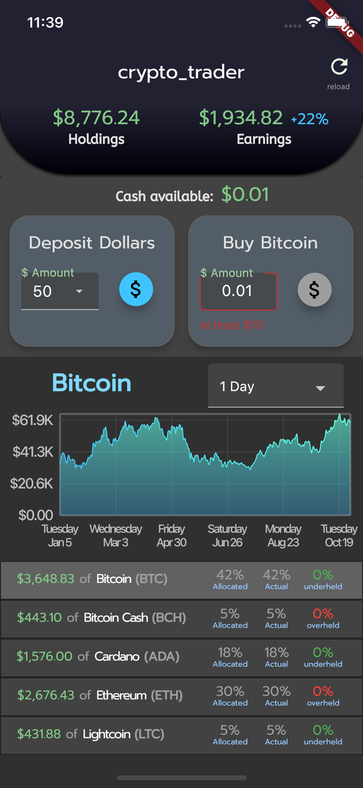

# crypto_trader

Flutter application for crypto-trading.

Tested only on iOS, but supporting other platforms ought to be relatively easy.

## Motivation

Coinbase Pro is insufficient

* Super janky on iPhone
    * Not very user-friendly on desktop either
* Doesn't offer automatic dollar cost averaging (DCA) as a service

### I couldn't find any sufficient DeFi startups (in 2021)

* I want a similar to M1 finance
    * I assemble an idealized portfolio
    * The app periodically adds money to resemble that portfolio
        * Aka "passive rebalancing"

## Features

* Deposit button
* Trade button that automatically buys in your most under-funded account
* Show your total earnings (and as percentage of total holdings)

## Future work

* Portfolio performance analysis?

## Screenshot

